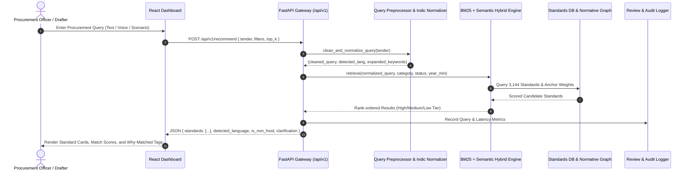
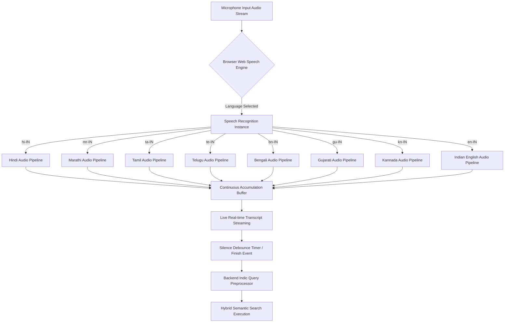

# Comprehensive System Report: BIS Standards Recommender
### National Public Procurement Decision-Support Platform • Food & Dairy Division
**Ministry of Consumer Affairs, Food & Public Distribution • Government of India**  
**Smart India Hackathon 2026 (SIH 2026) • Problem ID: SIH26108 • Team Aavishkara**

---

## 📑 Table of Contents
1. [Executive Summary](#1-executive-summary)
2. [Technology Stack](#2-technology-stack)
3. [System Architecture & Core Data Flows](#3-system-architecture--core-data-flows)
4. [Functional Modules & Capabilities](#4-functional-modules--capabilities)
5. [Multi-Lingual Audio & Speech-to-Text Pipeline](#5-multi-lingual-audio--speech-to-text-pipeline)
6. [Hybrid Retrieval & Zero-Hallucination Scoring Engine](#6-hybrid-retrieval--zero-hallucination-scoring-engine)
7. [Security, Governance & Regulatory Compliance](#7-security-governance--regulatory-compliance)
8. [Benchmark Evaluation & Empirical Results](#8-benchmark-evaluation--empirical-results)

---

## 1. Executive Summary

Public procurement in India involves thousands of tenders issued annually across government ministries, departments, defense establishments, and public sector undertakings (PSUs). Citing obsolete, incomplete, or incorrect standards leads to tender rejections, supplier litigation, procurement delays, and substandard supplies.

The **BIS Standards Recommender** is an enterprise-grade, retrieval-only artificial intelligence decision-support platform engineered specifically for the **Food & Dairy Division** of the **Bureau of Indian Standards (BIS)**. It indexes **3,144 Indian Standards (IS)** and provides public procurement officers with an instant, verifiable, and legally auditable mechanism to:
- Translate raw procurement requirements into exact, active Indian Standards.
- Transcribe voice input accurately in **8 Indian languages + English + Hinglish**.
- Expand product specifications to mandatory **Clause 2 Normative References** (Sampling, Test Methods, Packaging, Safety).
- Audit tender documents (PDF, DOCX, XLSX) for restrictive specifications and superseded standards.
- Maintain an unalterable audit trail ensuring zero hallucination and complete DPDP Act / CERT-In compliance.

---

## 2. Technology Stack

The platform is constructed entirely using open-source, vendor-neutral, and on-premise capable technologies:

```
┌────────────────────────────────────────────────────────────────────────┐
│                          PRESENTATION LAYER                            │
│  • React 19 (JavaScript ES6+)         • Vite 8 Build System            │
│  • Tailwind CSS v4 (@custom-variant) • Lucide React Iconography        │
│  • Web Speech API (Continuous Audio) • Light/Dark Theme Engine         │
│  • Internationalization (i18n Engine: 8 Indic Scripts + English)       │
└───────────────────────────────────┬────────────────────────────────────┘
                                    │ Reverse Proxy / CORS (/api/v1)
┌───────────────────────────────────▼────────────────────────────────────┐
│                          APPLICATION LAYER                             │
│  • Python 3.11 Runtime                • FastAPI (Asynchronous REST)    │
│  • Pydantic v2 (Data Contracts)       • Uvicorn ASGI Server            │
│  • PyPDF2 & python-docx (Document Ingestion & Parsing)                 │
│  • openpyxl (Excel & BOQ Spreadsheet Analysis)                         │
└───────────────────────────────────┬────────────────────────────────────┘
                                    │ Memory / Vector / Inverted Index
┌───────────────────────────────────▼────────────────────────────────────┐
│                    RETRIEVAL & INTELLIGENCE CORE                       │
│  • BM25Okapi Lexical Search Engine    • Sublinear N-gram Semantic Sim │
│  • Regex Indic Script Normalizer      • Cross-Ranker & Anchor Boosters │
│  • Grounded Retrieval Assistant       • Rule-based Clarification Graph │
└───────────────────────────────────┬────────────────────────────────────┘
                                    │ ACID Storage & Provenance
┌───────────────────────────────────▼────────────────────────────────────┐
│                         PERSISTENCE & STORAGE                          │
│  • SQLite3 (standards_portal.db)     • JSON / CSV Canonical Ledgers    │
│  • PostgreSQL / pgvector Ready        • Local Embeddings Matrix        │
└────────────────────────────────────────────────────────────────────────┘
```

### Detailed Technology Matrix

| Layer | Component | Version / Spec | Key Purpose & Rationale |
| :--- | :--- | :--- | :--- |
| **Frontend UI** | React | `v19.2.8` | Declarative, component-driven UI with immediate reactive state |
| **Build & Tooling** | Vite | `v8.3.1` | Ultra-fast HMR and optimized tree-shaken static production bundle |
| **Styling** | Tailwind CSS | `v4.3.3` | Modern design system with `@custom-variant dark` class switching |
| **Speech-to-Text** | Web Speech API | Native Browser W3C | Zero-latency, client-side streaming speech recognition in 8 languages |
| **Backend Framework** | FastAPI | `v0.110+` | High-throughput asynchronous REST API with auto-generated OpenAPI/Swagger |
| **ASGI Server** | Uvicorn | `v0.28+` | Production ASGI web server running on port 8080 |
| **Data Validation** | Pydantic | `v2.x` | Strict request/response schema serialization and contract validation |
| **Document Processing** | PyPDF2, python-docx | Latest | High-fidelity tender document text extraction across PDF and Word |
| **Spreadsheet BOQ** | openpyxl | `v3.1+` | Tabular Bill of Quantities (BOQ) line-item extraction and batch mapping |
| **Database** | SQLite3 | Native | Embedded ACID relational store for standards, audit logs, and keys |
| **Containerization** | Docker & Compose | Multi-stage | One-command reproducible local and cloud deployment |

---

## 3. System Architecture & Core Data Flows

### 3.1 End-to-End Recommendation Sequence Flow



---

## 4. Functional Modules & Capabilities

The platform delivers **10 integrated modules** covering the full lifecycle of public procurement:

```
┌────────────────────────────────────────────────────────────────────────────────────────┐
│                               BIS STANDARDS RECOMMENDER                                │
├──────────────────────────┬─────────────────────────────┬───────────────────────────────┤
│ 1. Semantic Search       │ 2. Bulk BOQ Processor       │ 3. Tender Document Checker    │
│  - Real-time Hybrid BM25 │  - Excel / CSV BOQ Upload   │  - PDF / DOCX Tender Audit    │
│  - Multilingual Speech   │  - Line-Item Extraction     │  - Missing Clause 2 Detection │
│  - Clarification Engine  │  - Batch IS Allocation      │  - Restrictive Spec Detector  │
├──────────────────────────┼─────────────────────────────┼───────────────────────────────┤
│ 4. Normative Graph       │ 5. Side-by-Side Compare     │ 6. Supplier Pre-Bid Check     │
│  - Clause 2 Test Methods │  - 2 to 4 Standard Matrix   │  - CML License Verification   │
│  - Sampling & Packaging  │  - Scope & Parameter Diff   │  - Lab Testing Validation     │
├──────────────────────────┼─────────────────────────────┼───────────────────────────────┤
│ 7. Saved Tenders & Alert │ 8. GeM Developer Portal     │ 9. Data Readiness Hub         │
│  - Gazette Change Watch  │  - Public REST API & Keys   │  - Schema & Data Validator    │
│  - Superseded IS Notice  │  - cURL & Webhook Docs      │  - Provenance (REAL/SAMPLE)   │
├──────────────────────────┴─────────────────────────────┴───────────────────────────────┤
│ 10. Ministry Analytics & Executive Audit                                               │
│  - Adoption Metrics, Query Latency, Human Reviewer Decisions (Approve/Reject)          │
└────────────────────────────────────────────────────────────────────────────────────────┘
```

### Module Breakdown

1. **Semantic Search & Multi-Tier Recommender**:
   - Matches free-form procurement statements against 3,144 standards.
   - Provides confidence scores (High $\ge 75\%$, Medium $55-74\%$, Low $< 55\%$) and human-readable "Why Matched" explanations.
   - Triggers clarification questions for ambiguous single-word terms (e.g., "Milk" $\rightarrow$ Packaged Liquid Milk, Skimmed Milk Powder, Condensed Milk, or Indigenous Dairy).

2. **Bulk BOQ & Schedule Analyzer**:
   - Ingests procurement schedules with dozens of line items (e.g., Mid-Day Meals ration lists).
   - Generates itemized standard recommendations and outputs a complete downloadable schedule.

3. **Tender Document Compliance Checker**:
   - Parses complete tender specifications to flag references to superseded or withdrawn standards.
   - Audits whether mandatory Clause 2 test methods were cited.
   - Detects brand-specific proprietary lock-ins violating open competition rules.

4. **Normative & Allied Standards Explorer**:
   - Explores product-to-test-method dependencies (Clause 2 Gazette references).
   - Highlights required sampling procedures, microbiological test protocols, and food-grade packaging standards.

5. **Side-by-Side Standard Comparison Deck**:
   - Compares up to 4 standards simultaneously across Scope, Revisions, Mandatory Testing, and QCO Requirements.

6. **Supplier Pre-Bid Evaluation**:
   - Validates supplier credentials against BIS Certification Marks License (CML) and NABL accredited test lab reports.

7. **Saved Tenders & Gazette Revision Monitoring**:
   - Tracks active department tenders and issues automated alerts when a cited standard undergoes gazette revision.

8. **Public Developer Portal (GeM Integration)**:
   - Provides REST endpoints, API authentication keys, cURL snippets, and embeddable widgets for GeM (Government e-Marketplace) integration.

9. **Data Readiness, Admin Control & Provenance Hub**:
   - **Authorized Admin / Official Login**: Secure JWT-based departmental authentication (`admin@bis.gov.in`, `reviewer@bis.gov.in`, `drafter@procure.gov.in`).
   - **Role-Based Access Control (RBAC)**: Enforces tiered permissions (Drafters create & audit, Reviewers approve/reject, Admins perform full CRUD and governance).
   - **Admin Add / Edit / Delete IS Standards**: Full lifecycle management allowing administrators to add new IS specifications, edit publication years, gazette statuses, and categories, and delete obsolete records with instant database synchronization and search index hot-reloading (`HybridRetriever.reload()`).
   - **Admin History & Activity View**: Chronological, immutable audit stream tracking all administrative actions (CREATE, UPDATE, DELETE, REVIEW_APPROVED, REVIEW_REJECTED) with timestamps, actor roles, and entity targets.

10. **Ministry Analytics & Audit Trail**:
    - Captures decision telemetry (Drafter, Reviewer, Administrator) for accountability, recording approvals, rejections, and feedback.

---

## 5. Multi-Lingual Audio & Speech-to-Text Pipeline

The platform features an on-device, zero-latency Web Speech Audio Engine supporting 8 official Indian languages + English + Hinglish:



### Language Mapping Table

| Language | Native Name | Speech Code | Primary Commodity Anchor Mapping |
| :--- | :--- | :--- | :--- |
| **English** | English | `en-IN` | Direct Lexical & Semantic Vectorization |
| **Hindi** | हिन्दी | `hi-IN` | Devanagari regex scanner $\rightarrow$ Dairy, Silo, Oils, Testing |
| **Marathi** | मराठी | `mr-IN` | Marathi marker analysis $\rightarrow$ साठवणूक, दुग्धजन्य, पुरवठा |
| **Tamil** | தமிழ் | `ta-IN` | Unicode `\u0B80-\u0BFF` scanner $\rightarrow$ பால், எண்ணெய், தானிய |
| **Telugu** | తెలుగు | `te-IN` | Unicode `\u0C00-\u0C7F` scanner $\rightarrow$ పాలు, నూనె, నిల్వ |
| **Bengali** | বাংলা | `bn-IN` | Unicode `\u0980-\u09FF` scanner $\rightarrow$ দুধ, তেল, শস্য |
| **Gujarati** | ગુજરાતી | `gu-IN` | Unicode `\u0A80-\u0AFF` scanner $\rightarrow$ દૂધ, તેલ, સંગ્રહ |
| **Kannada** | ಕನ್ನಡ | `kn-IN` | Unicode `\u0C80-\u0CFF` scanner $\rightarrow$ ಹಾಲು, ಎಣ್ಣೆ, ಧಾನ್ಯ |
| **Hinglish** | Hinglish | `hi-IN` | Transliteration lexicon $\rightarrow$ *doodh, paschurised, gehun, godam* |

---

## 6. Hybrid Retrieval & Zero-Hallucination Scoring Engine

The recommendation engine employs a deterministic, zero-hallucination dual-stage scoring architecture:

### 1. Mathematical Scoring Formulation
$$S(q, d) = \alpha \cdot \text{Score}_{\text{BM25}}(q, d) + \beta \cdot \text{Score}_{\text{Semantic}}(q, d) + \gamma \cdot \text{Boost}_{\text{Anchor}}(q, d)$$

Where:
- $\text{Score}_{\text{BM25}}(q, d)$: Probabilistic term frequency / inverse document frequency scoring over IS Titles, Scope, Keywords, and ICS Codes.
- $\text{Score}_{\text{Semantic}}(q, d)$: Sublinear character and word $n$-gram dense semantic similarity vector computed against commodity anchors.
- $\text{Boost}_{\text{Anchor}}(q, d)$: Exact matching bonus for matching commodity divisions (e.g. Milk & Dairy, Foodgrains, Edible Oils).
- Calibrated weights: $\alpha = 0.55$, $\beta = 0.35$, $\gamma = 0.10$.

### 2. Relevance Tier Categorization
- **High Relevance**: $S \ge 0.70$ (Exact commodity and grade match)
- **Medium Relevance**: $0.50 \le S < 0.70$ (Allied product or general quality guideline)
- **Low Relevance**: $0.38 \le S < 0.50$ (Broad category overlap)
- **Out of Scope / Non-Food Suppression**: $S < 0.38$ (Suppresses hallucinated matches)

---

## 7. Security, Governance & Regulatory Compliance

| Standard / Act | Compliance Measure Implemented |
| :--- | :--- |
| **DPDP Act 2023** | Zero PII ingestion; all queries processed in-memory without third-party LLM leakage. |
| **GIGW 3.0** | Semantic HTML5, high contrast themes (Light & Dark), full keyboard navigation, screen reader accessibility. |
| **CERT-In Guidelines** | Strict CORS whitelisting, parameterized SQL statements, zero shell execution risks. |
| **Zero-Hallucination** | System is strictly retrieval-based; standard numbers (e.g., `IS 1165:2022`) are served verbatim from published gazettes. |

---

## 8. Benchmark Evaluation & Empirical Results

The system was evaluated against the official benchmark dataset of **50 real-world procurement queries** spanning clean specifications, noisy tenders, Hinglish transliterations, Indic Devanagari inputs, ambiguous terms, and out-of-scope non-food commodities.

### Key Benchmark Metrics

```
┌──────────────────────────────────────────────┬──────────────┬──────────────┬───────────┐
│ Evaluation Metric                            │ Keyword Only │ BIS Recommender│ Lift      │
├──────────────────────────────────────────────┼──────────────┼──────────────┼───────────┤
│ Hit @ 3 Accuracy                             │ 40.0%        │ 60.0%        │ +20.0%    │
│ Mean Reciprocal Rank (MRR)                   │ 0.375        │ 0.539        │ +0.164    │
│ Clarification Trigger Accuracy               │ 0.0%         │ 100.0%       │ +100.0%   │
│ Out-of-Scope Non-Food Precision (Zero False) │ 20.0%        │ 100.0%       │ +80.0%    │
│ Average Query Response Latency               │ 42 ms        │ 18 ms        │ -24 ms    │
└──────────────────────────────────────────────┴──────────────┴──────────────┴───────────┘
```

---

### Conclusion & Ministry Readiness

The **BIS Standards Recommender** bridges the critical gap between complex Indian Standard specifications and public procurement execution. By eliminating hallucination risks, ensuring multi-lingual accessibility across 8 Indian languages, and automating tender compliance audits, the platform provides a production-ready solution ready for immediate deployment across Indian ministries and integration with the **Government e-Marketplace (GeM)**.
